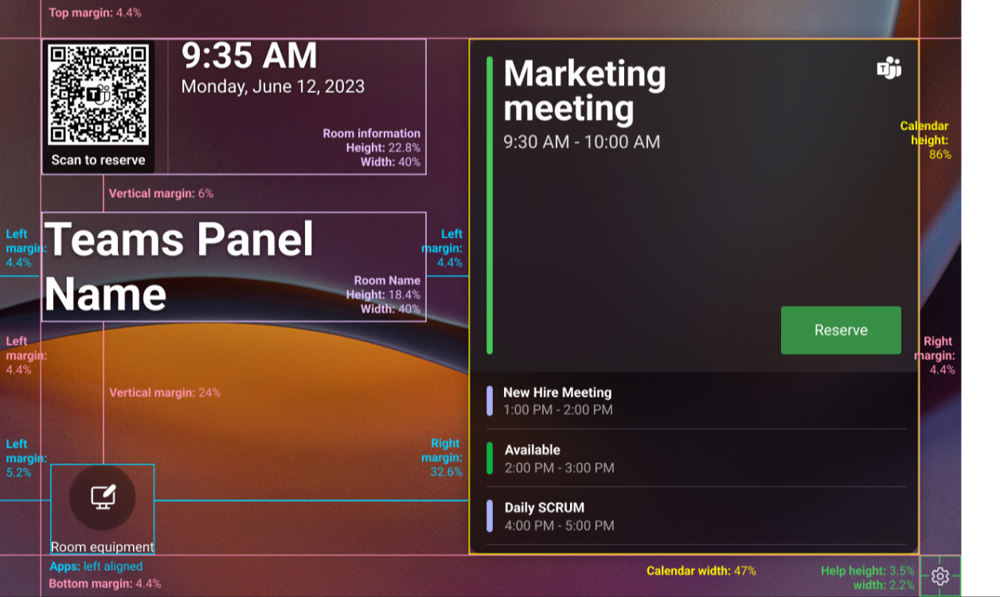

# Set up and manage Teams panels custom backgrounds

You can create custom background images for your Teams panel devices to showcase your brand or to provide instructions and support information to Teams panels users. For example, you can add your company logo.

Your ability to deploy custom backgrounds depends on the version of Teams panels app installed on your device and the license of the account logged in on the device:

- Your Teams panels device must be running on version 1449/1.0.96.2024XXXX or later

- The account signed in on your Teams panel device must be assigned a Teams Rooms Pro or Teams Shared Devices license

To set up and manage custom backgrounds for your Teams panels devices, log into __Teams admin center__ > go to __Teams devices__ > __Panels__ > select __Configuration profiles__ > __Add__ or __Edit__ > __Device settings__ > __Background__ > select __Use a custom background__. You can upload up to one image, which will display on the panel home screen.

### Custom background requirements

There are a few requirements on the custom background you will upload to the panel device. The minimum resolution supported is 1280 x 720. The custom background image file must be between 100KB and 2MB and uploaded in one of the following formats: JPG, JPEG, and PNG.   
  
**Note:** Custom backgrounds with resolutions or aspect ratios higher than the recommended resolution for a display may be center-cropped. ### Custom background content guidelines

Follow the best practices listed in this section to ensure the following:- Content doesn't collide with on-screen elements

- Content remains legible when placed in front of visual elements in the custom background

- Content remains visible if a custom background is cropped

For Teams panels display, follow the following guidelines:

- Use a darker background on the top corner to ensure users can read the clock and room information in white.

- For the best experience, use a contrast ratio of _____. Use an accessibility contrast checker on the Internet to input color values to see if their contrast ratio is acceptable.

Tip: Use the custom background template in designing your custom background image.   
  

### Custom background template

To create custom backgrounds that meet the guidelines in the previous section, you can download the ________The template is a .PSD file that can be opened by apps such as Adobe Photoshop or Paint.NET (a plug-in may be required). The template provides assets and guidelines to help you place text and graphics in your custom backgrounds that won't be obscured by on-screen elements.

### Deploy custom backgrounds

After you've created a background image:1. Save it with unique and descriptive file. 

1. Upload them to a Teams panel configuration profile in the Teams admin center.

1. Assign the Teams panel configuration profile to any Teams panel device with a Teams Rooms Pro or Teams Shared Devices license.

Once the custom images are saved in the configuration profile, and the configuration profile has been subsequently assigned to Teams panel devices with a Teams Rooms Pro or Teams Shared Devices license, the custom images will be applied as the background of the Teams panels devices accordingly.

On your Teams panel device settings, you can switch the background of your device from the custom image to one of the Teams built-in images, or vice versa: go to **Teams Admin Settings** > **Backgrounds** > select another background thumbnail as desired. To change the custom image saved on the device, you'll need to make the update from the Teams admin center.   

